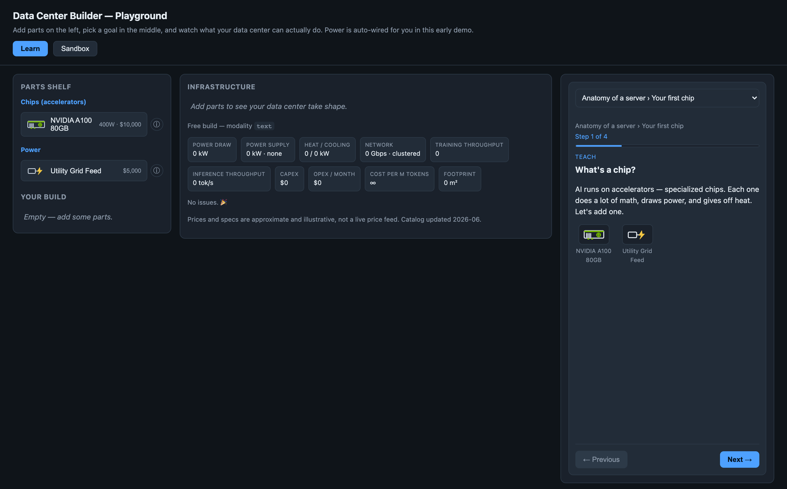
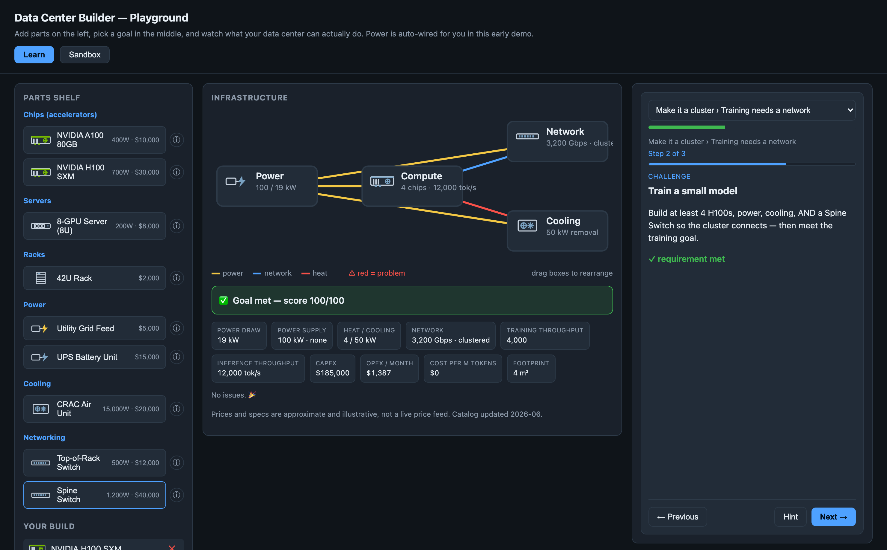
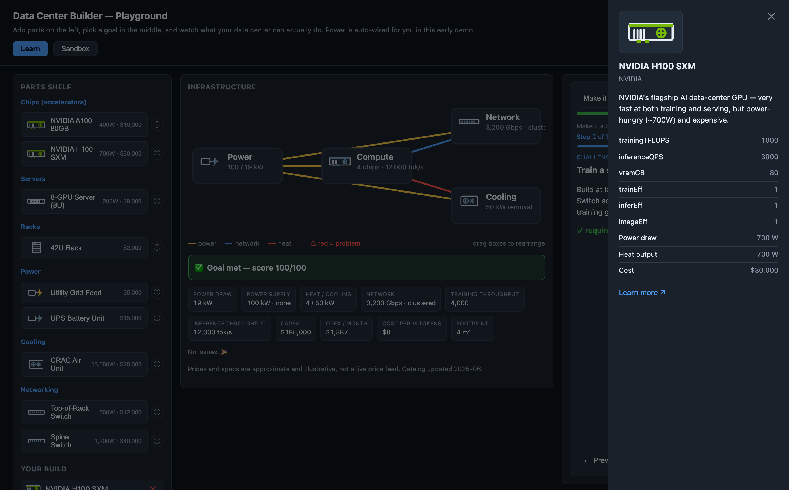

# Data Center Builder

**▶ Live demo: https://jpatel3.github.io/datacenter-builder/** (auto-deploys from `main` via GitHub Actions)

A standalone, browser-based educational game where you build AI data centers and learn what actually goes into one — chips, racks, power, cooling, networking, land — and how those choices trade off on **cost, capacity, and the difference between training and inference** (and text vs. image workloads).

Aimed at college / early-career tech learners. Numbers and vendor names are realistic-ish (NVIDIA, AMD, AWS Trainium/Inferentia, Google TPU) but simplified for intuition, not engineering-grade accuracy.

## Screenshots

**Guided "Learn" mode** — block-by-block lessons; parts unlock as you progress:



**The infra board** — a live, color-coded schematic of your build (⚡ power · network · heat) that turns red when something's wrong; drag the nodes to rearrange. The lesson panel (right) keeps Previous/Next pinned and the course bar in its header:



**Part details** — click ⓘ on any part for a plain-language description, specs, cost, and a learn-more link:



## Roadmap

| # | Subsystem | Status |
|---|-----------|--------|
| 1 | Simulation core (headless engine + component/pricing catalog) | ✅ Built |
| 2 | Playground UI (Vite) | ✅ Built |
| 3 | Curriculum Modules 1–3 (guided Learn mode) | ✅ Built |
| 4 | UI: lesson progress, navigation, infra board, part details | ✅ Built |
| 5 | Curriculum Modules 4–6 (chip choice → cost → ChatGPT/Midjourney/DeepSeek/Llama) | ✅ Built |
| 6 | Movable infra board nodes | ✅ Built |
| 7 | Accounts + save/share (GitHub sign-in, public link + fork, progress sync) | ✅ Built (Supabase) |
| 8 | Isometric "Minecraft" build canvas | 📋 Planned |

**Full product spec, decision log, and roadmap → [docs/PRD.md](docs/PRD.md).** Per-subsystem designs live in `docs/superpowers/specs/`; implementation plans in `docs/superpowers/plans/`.

Run `npm run dev` and open the local URL. **Learn** mode walks you from "your first chip" through power, cooling, and networking to building the infrastructure behind ChatGPT, Midjourney, DeepSeek, and Llama. **Sandbox** unlocks every part for free building.

## Simulation core

Pure TypeScript, no DOM. A *build* is plain serializable data; pure evaluators compute the truth.

```ts
import { catalog, evaluateBuild, evaluateAgainstWorkload } from "./src/sim";

const build = {
  components: [
    { instanceId: "g0", typeId: "gpu-nvidia-h100", position: { x: 0, y: 0 } },
    { instanceId: "p0", typeId: "power-grid-feed", position: { x: 1, y: 0 } },
    { instanceId: "c0", typeId: "cooling-crac", position: { x: 2, y: 0 } },
  ],
  connections: [{ from: "g0", to: "p0", kind: "power" }],
};

const metrics = evaluateBuild(build);
// → power / thermal / compute / cost / network / space / violations

const result = evaluateAgainstWorkload(build, {
  type: "inference", modality: "text", model: "ChatGPT-ish", qpsTarget: 5000,
});
// → { passed, score, bottleneck, metrics }
```

What it models (credible but simplified, steady-state):

- **Power** draw vs. supply, deficit, n+1 redundancy.
- **Thermal** heat vs. cooling capacity.
- **Compute** training vs. inference throughput — training collapses without enough interconnect; inference scales linearly. **Image** workloads cost far more compute per output than text.
- **Chip specialization** — Trainium shines at training, Inferentia at serving; using a chip off its sweet spot still works but raises a friendly `chip-mismatch` warning (never a hard block).
- **Cost** — capex, monthly opex (USD), and **cost-per-million-tokens** (the affordability metric real-world systems are judged on).
- **Violations** — power deficit, overheating, unpowered components, rack overfull, weight, missing network, over land budget, chip mismatch.

## Develop

```bash
npm install
npm run dev        # local app at http://localhost:5174/
npm test           # vitest
npm run typecheck
```

Architecture: a headless, fully-tested **simulation core** (`src/sim/`) computes the truth; a declarative **curriculum** (`src/curriculum/`) layers lessons on top reusing that engine; a thin **backend** (`src/backend/`, Supabase) adds accounts/save/share; and **`src/main.ts`** is the only file that touches the DOM. Design docs live in `docs/` (start with [`docs/PRD.md`](docs/PRD.md)).

## Contributing

Contributions are welcome — this is a learning project meant to stay approachable.

- **Found a bug or have an idea?** Open an [issue](https://github.com/jpatel3/datacenter-builder/issues).
- **Want to add a part, lesson, or scenario?** The component catalog (`src/sim/catalog.ts`) and curriculum (`src/curriculum/content.ts`) are plain data — easy first contributions. Keep numbers realistic-ish but simple; flag estimates honestly.
- **Code changes:** keep `npm test` and `npm run typecheck` green, and keep the simulation core DOM-free. Open a PR describing the change.
